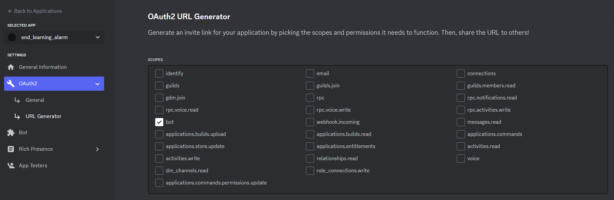
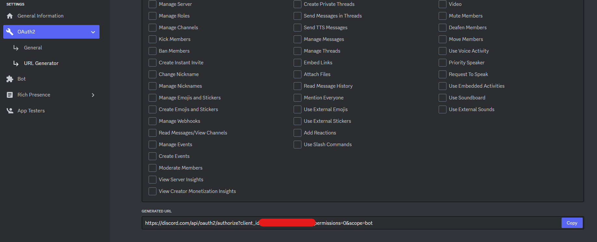
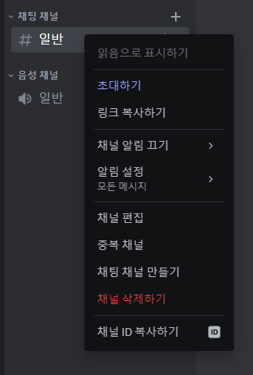

# python discord.py 설치 방법

```pip
pip install discord.py
```
사용하여 discord.py 앱 설치


# 사용 방법 


## 1. 디스코드 봇 토큰 발급


1. [디스코드 개발자 페이지](https://discord.com/developers/applications)에 접속합니다.
2. `New Application` 버튼을 클릭합니다.
3. `Application Name`에 봇의 이름을 입력합니다.
4. `Create` 버튼을 클릭합니다.
5. 왼쪽 메뉴에서 `Bot`을 클릭합니다.
6. `Add Bot` 버튼을 클릭합니다.
7. `Yes, do it!` 버튼을 클릭합니다.


### 1.1. 디스코드 봇 토큰 발급 확인
<!-- ./img/oauth_bot.png 이미지 출력하는 마크다운 코드 -->


### 1.2. 디스코드 봇 url 생성

<!-- ./img/oauth_url.png -->



## 2. 디스코드 채널 ID 추출 


<!-- ./img/채널_id.png 출력하는 마크다운 코드 -->  



### 3. python code 실행

<!-- 파이썬 색상을 표시하는 마크다운 문법 코드  -->
```python
TOKEN = "" # discord bot token - type : str
CHANNEL_ID = 1 # channel token - type : int
```
str, int형 타입 주의


## 실행 결과 

<!-- ./img/result.png 출력하는 마크다운 코드 -->


## 주의사항


1. Channel ID 의 타입은 str이 아닌 int형

